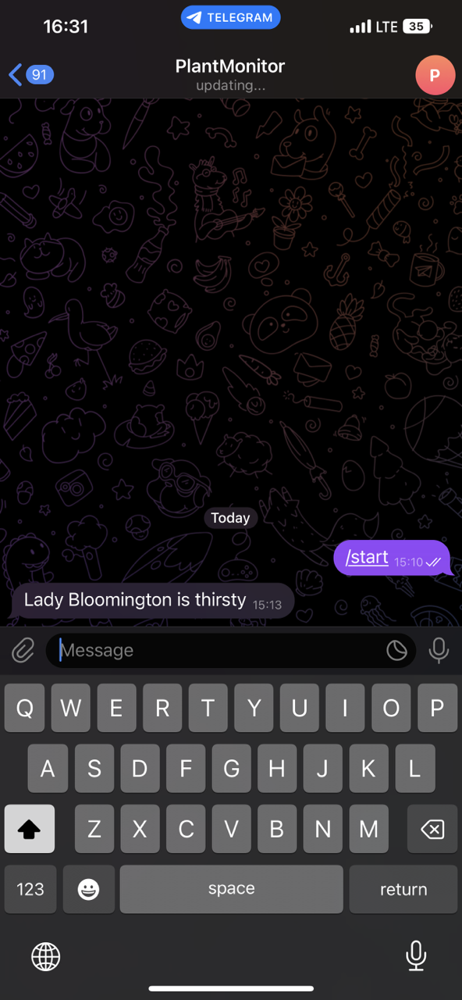
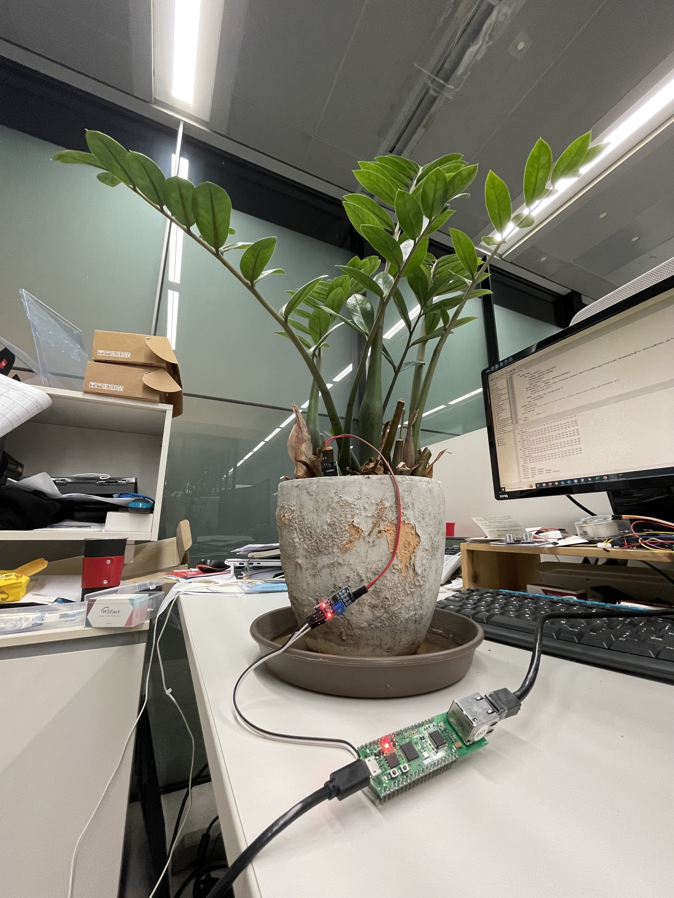

# Plant Monitoring using W5100S-EVB-Pico

## Introduction

Indoor plants require regular care, and while engrossed in work at your desk, it's easy to overlook them. We have a beautiful plant in our office. Nobody knows what it is called and how to maintain it, so I called it Lady Bloomington and tried to make a device that will help us taking care of it. This project will show how W5100S-EVB-Pico can assist in such situation.

Soil hydration sensors gauge the soil's conductivity and relay this data to devices like the Raspberry Pi Pico W through a voltage signal. This voltage is captured by an analog GPIO pin, which translates it into a range from 0 to 65535. A lower value indicates drier soil, which can then act as a cue to send an alert.

## Connecting the things

The setup is quite straightforward. A soil hydration sensor is linked to three GPIO pins. The initial two pins, 3V3 power and GND, supply the necessary power to the sensor.

The third pin, termed 'Signal', serves as an output that transmits a value to the Raspberry Pi Pico. This transmitted voltage is then interpreted by the relevant GPIO as a value ranging from 0 to 65535. The code subsequently utilizes this value to ascertain the plant's water needs.

Here's how the soil hydration sensor is connected.

| Sensor | W5100S-EVB-Pico |
|--------|-----------------|
| VCC | 3V3 (physical pin 36) |
| GND | Any GND pin |
| Signal | GP26 |


## Setup the Telegram bot

Creating Telegram bot is a simple process.

* Sign in to your Telegram account
* Create a chat with BotFather
* Create a new bot using the /newbot command and follow screen instructions
* Save your API key
* In Telegram, create a new chat with IDBot and ask for your ID using /getid command.

## The code

* Download the latest Micropython firmware for W5100S-EVB-Pico and copy it to the board
* Create a new file and copy the contents from here for statistics module
https://raw.githubusercontent.com/rcolistete/MicroPython_Statistics/master/statistics.py
* Create another file that will be served as main

Let's check the code step-by-step

1. Import required modules
```python
from usocket import socket
from machine import Pin,SPI, ADC
import network
import time
import statistics
import urequests
```

2. Copy your Telegram API token and Chat ID

```python
API = "YOUR TOKEN HERE"
ID = "YOUR CHAT ID HERE"
sensor = ADC(Pin(26))
```

3. w5x00_init function that will initialize Ethernet settings
```python
def w5x00_init():
    spi=SPI(0,2_000_000, mosi=Pin(19),miso=Pin(16),sck=Pin(18))
    nic = network.WIZNET5K(spi,Pin(17),Pin(20)) #spi,cs,reset pin
    nic.active(True)
    
    #None DHCP
    nic.ifconfig(('192.168.11.40','255.255.255.0','192.168.11.1','8.8.8.8'))
    
    #DHCP
    #nic.ifconfig('dhcp')
    
    print('IP address :', nic.ifconfig())
    while not nic.isconnected():
        time.sleep(1)
        print(nic.regs())
```
4. The main function

Create an empty array "readings". We will store multiple values here:
```python
readings = []
```
5. Create the try and while loop
```python
try:
   while True:
```
6. Using for loop, we will read values from the soil moisture sensor and append the array. Reading will be done with 1 second interval.
```python
for i in range(5):
               reading = sensor.read_u16()
               readings.append(reading)
               print(readings) 
               time.sleep(1)
```
7. Using the statistics module, we will calculate the median_value
```python
median_value = statistics.median(readings)
```
8. Using a conditional statement, the message will be sent to Telegram chat using urequests. Here it is required to have a token and chat ID that were noted in step 1.
```python
if median_value < 40000:
               urequests.get("https://api.telegram.org/bot"+API+"/sendMessage?text=Lady Bloomington is thirsty&chat_id="+ID)
               print("Message Sent")
           else:
               print("Lady Bloomington has enough water")
```
9. Save the code as main.py on the board and it will run automatically once the board is powered.

As I have no idea what is the required moisture level for the plant we have in office, I set the median comparison value to 40000.

After running the code I got Telegram message as following::



For the next project, I will first identify the plant and ask ChatGPT for the appropriate moisture level. Hopefully, AI service can help me to take better care of our plants.

